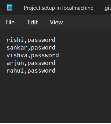
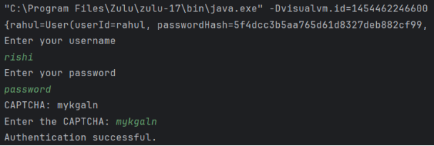
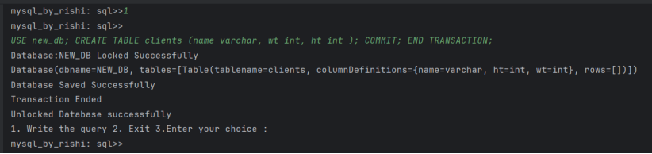
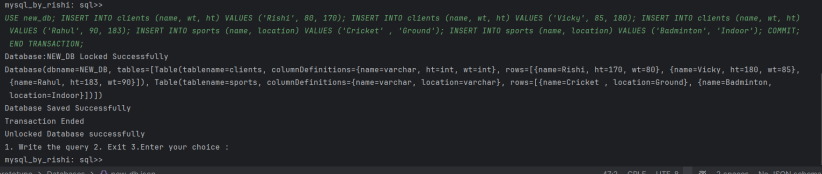
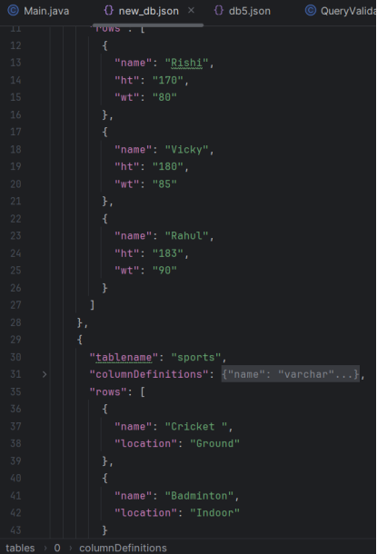
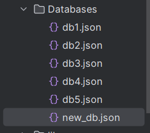

# Lightweight DBMS Prototype

## Overview

This project is a prototype of a lightweight database management system (DBMS) implemented in Java. The application mimics basic functionalities of MySQL and is developed using Object-Oriented Programming (OOP) principles and SOLID design principles. The program is built to handle essential database operations using MySQL syntax, while storing user information and databases in text and JSON files respectively.

## Features

- **User Authentication**: Verifies users using password hashing (MD5) and Captcha for two-factor authentication.
- **Database Management**: Allows users to create, use, and manage databases with restrictions on the number of databases created per session.
- **Query Processing**: Supports various SQL operations, including:
  - `USE DATABASE`
  - `CREATE DATABASE`
  - `CREATE TABLE`
  - `INSERT VALUES`
  - `UPDATE VALUES`
  - `SELECT VALUES`
  - `COMMIT`
  - `ROLLBACK`
- **Data Storage**: Databases are stored as JSON files, and data is parsed and manipulated using regular expressions.

## Requirements

- **Programming Language**: Java (No third-party libraries are used)
- **IDE**: IntelliJ IDEA
- **Java Version**: Zulu-JDK 17

## Classes Overview

1. **User**: Manages user details and handles password hashing.
2. **Database**: Manages tables and operations related to databases.
3. **TableDetails**: A POJO class for storing table and column details.
4. **QueryEngine**: Processes and validates queries and transactions.
5. **QueryService**: Handles query execution and data manipulation.
6. **QueryValidationUtils**: Validates syntax of SQL queries.
7. **AuthenticationService**: Handles user authentication.
8. **CaptchaGenerator**: Generates Captchas for two-factor authentication.
9. **Main**: The entry point of the application.

## Functionalities

### User Verification

- Users must authenticate using a password and Captcha.
- Incorrect credentials or Captcha result in an error message and re-authentication request.

### Database Operations

- **Create Database**: Users can create one database per session. Existing databases cannot be overwritten.
- **Use Database**: Switch between databases.
- **Create Table**: Define new tables within the selected database.
- **Insert Values**: Add rows to tables.
- **Update Values**: Modify existing rows in tables.
- **Select Values**: Retrieve data from tables.
- **Commit**: Save changes to the database.
- **Rollback**: Undo changes if a transaction fails.

## Usage

1. **Run the Application**: Execute the `Main` class to start the application.
2. **Authenticate**: Provide username, password, and Captcha for login.
3. **Perform Operations**: Use SQL queries to interact with the database.

## Examples

- **Create Database**:
  ```sql
  CREATE DATABASE new_db;
  ```

- **Use Database**:
  ```sql
  USE new_db;
  ```

- **Create Table**:
  ```sql
  CREATE TABLE clients (id INT, name VARCHAR(100));
  ```

- **Insert Values**:
  ```sql
  INSERT INTO clients (id, name) VALUES (1, 'Rishi');
  ```

- **Update Values**:
  ```sql
  UPDATE clients SET name = 'Rishi Varman' WHERE id = 1;
  ```

- **Select Values**:
  ```sql
  SELECT * FROM clients;
  ```

- **Commit**:
  ```sql
  COMMIT;
  ```

- **Rollback**:
  ```sql
  ROLLBACK;
  ```

## Images

1. **User Verification with Password and Captcha**

   

2. **Successful Two-Factor Authentication**

   

3. **Preventing Multiple Database Creation**

   

4. **Successful Database Creation**

   

5. **Successful Update and Rollback Operations**

   
   

## Tools Used

- **IDE**: IntelliJ IDEA CE
- **Regex Tool**: [Online Regex Tool](https://regex101.com/)

## Known Issues

- Bulk insert is not supported; multiple insert queries need to be provided separately.
- Ensure that the Captcha functionality and file paths are correctly configured.
